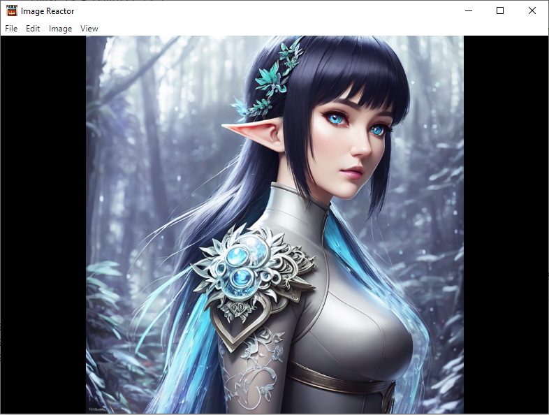

# Image Reactor

A lightweight image viewer in the style of Irfan View

Cross-compatible on Windows, Mac, Linux

Written in Electron (Javascript)
    
<div style="display: flex; justify-content: center">

</div>

## Usage

`Install dependencies:`

```bash

npm install
```

Run:

```bash
npm start
```


